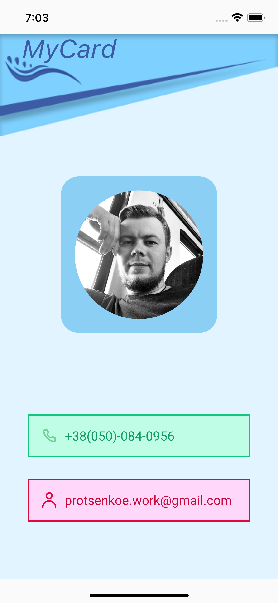

# Building a Sample Business Card using Flutter

A flutter app built using the following Widgets, Assets and other Flutter Properties,
- QrImage
- FlipCard
- Circle Avatar
- Safe Area Widget
- Column
- Row
- Scaffold
- BoxDecoration
- Title
- Padding
- Image Asset
- Font Asset

### Installation

If you're new to Flutter the first thing you'll need is to follow the [setup instructions](https://flutter.dev/docs/get-started/install).

Once Flutter is setup, you can use the default `stable` channel, or switch to the latest `dev` version to get the most current fixes for desktop/web:
* Run `flutter channel dev`
* Run `flutter upgrade`

If you've never run a desktop build before, you will need to enable it with a one-time command for your current platform:
* `flutter config --enable-macos-desktop`
* `flutter config --enable-windows-desktop`
* `flutter config --enable-linux-desktop`

Once you're on `dev` and desktop is enabled, you're ready to run the app:
* `flutter run -d windows`
* `flutter run -d macos`
* `flutter run -d linux`
* `flutter run -d android`
* `flutter run -d ios`
* `flutter run -d web`

If you re-start your IDE, you should also see a new launch option for your current desktop platform.

## Layouts Reference and Terminologies:

  ### Terminologies:

  ### Container-Child-Children:

  A CONTAINER can have only one child but if you want to have multiple children you need to go with something called as **rows** and **columns**. ROWS are considered horizontal (RH) and COLUMNS are considered vertical (CV). rows and columns they'll have a property name children and  it will be of type  widget list. `children: <Widget>[] (<OTHER WIDGETs here>)`

  ### Margin and Padding:

  when you want to control the area outside and container it is called a margin then you want to control the elements position within the container it is called padding

  ### Sized Box:

  If you want to create a space between the containers within the rows or columns you can use something called as the sized box widget.Its just a place holder.

  ### Safe Area Widget:

  This is a widget which will set itself within the boundaries of any phone, so that it will not be hidden behind any phone specific external design.

  ## Layouts :

  ### Layout 1:

  

  ### Layout 2:

  

  ### Layout 3:

  